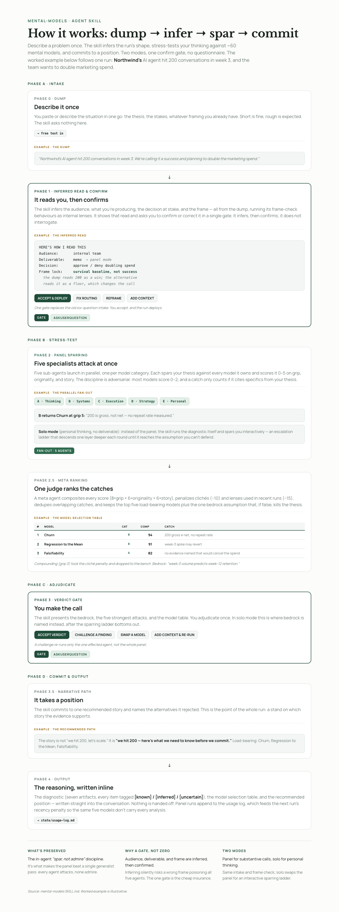

# mental-models

A cognitive partner that stress-tests your thinking, then commits to a position.

`mental-models` is an [agent skill](https://docs.claude.com/en/docs/claude-code/skills) that spars with you against a library of ~60 mental models. Hand it a strategy, a thesis, a decision, or a problem; it finds what you've missed, scores the models that actually bite, and takes a stand on the story the evidence supports. It grapples with you, not for you.



## What it does

Two modes, chosen automatically from what you hand it:

- **Panel mode**, for substantive problems, convenes five specialist sub-agents, one per model category. Each spars your idea against every model in its category and scores it on grip, originality, and story value. A meta agent composites the scores, penalizes clichés and recently-used lenses, and keeps only the few load-bearing models that carry the decision.
- **Solo mode**, for personal thinking, spars with you interactively, descending one layer deeper each round until it reaches the assumption you can't defend further.

Either way it ends with a position, the reasoning laid out, and every finding tagged `[known]` / `[inferred]` / `[uncertain]` so you can audit it.

## How a run goes

1. **Dump.** You describe the situation in one go. No questionnaire.
2. **Inferred read.** It infers the audience, what you're producing, and the frame, then shows you that read and asks you to confirm or correct it in a single gate.
3. **Stress-test.** The panel, or interactive sparring, attacks the thesis.
4. **Rank and verdict.** Models are scored and ranked; you adjudicate.
5. **Position.** It commits to one narrative path, with alternatives named and dismissed.
6. **Output.** The diagnostic, the model table, and the recommended position, written inline.

## The model library

Roughly 60 models across five categories:

| Category | Theme |
|---|---|
| **A · Thinking Foundations** | how to reason, perceive, and form beliefs accurately |
| **B · Systems & Dynamics** | how systems behave, compound, and break |
| **C · Execution & Agency** | how to get things done and where leverage lives |
| **D · Strategy & Markets** | how competition, value, and disruption work |
| **E · Personal Practice** | behavioral and mental discipline |

Full entries live in `references/models/`. The sparring discipline lives in `references/behavior-catalog.md`; the panel machinery in `references/panel-protocol.md`.

## Install

Clone into your skills directory:

```bash
git clone https://github.com/umarmsharif/mental-models.git ~/.claude/skills/mental-models
```

Then invoke it from Claude Code:

```
/mental-models
```

Or describe a problem and let the skill trigger on its own.

## Requirements

A host that supports agent skills with the **AskUserQuestion** and **Agent** (sub-agent) tools, such as Claude Code. Solo mode runs without sub-agents; panel mode needs them.

## License

MIT — see [LICENSE](LICENSE).
